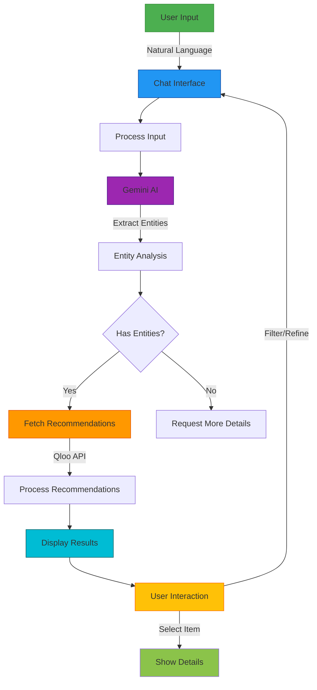

# 🎯 TasteSphere - AI-Powered Recommendation Engine

TasteSphere is an intelligent recommendation platform that uses AI to understand your preferences and suggest personalized content across various categories like movies, books, music, and more. Built with React, Tailwind CSS, and powered by Google's Gemini AI and Qloo's cultural recommendation API.


## 🌟 Features

- **AI-Powered Recommendations**: Uses Google's Gemini AI to understand user preferences
- **Multi-Category Support**: Get recommendations for movies, books, music, podcasts, and more
- **Interactive Chat Interface**: Natural language processing for easy preference input
- **Responsive Design**: Works seamlessly on desktop and mobile devices
- **Dark Mode**: Eye-friendly dark theme support
- **Real-time Filtering**: Filter recommendations by category or type
- **Detailed Entity Analysis**: View detailed analysis of your preferences

## 🛠️ Technologies Used

- **Frontend**: React 19, Vite
- **Styling**: Tailwind CSS 4
- **Animation**: Framer Motion
- **State Management**: React Context API
- **AI/ML**: Google Gemini API
- **Recommendations**: Qloo API
- **Icons**: Heroicons
- **Routing**: React Router v6

## 🚀 Getting Started

### Prerequisites

- Node.js (v18 or higher)
- npm or yarn
- Google Gemini API Key
- Qloo API Key (optional - mock data available)

### Installation

1. Clone the repository:
   ```bash
   git clone https://github.com/yourusername/tastesphere.git
   cd tastesphere
   ```

2. Install dependencies:
   ```bash
   npm install
   # or
   yarn install
   ```

3. Create a `.env` file in the root directory and add your API keys:
   ```env
   VITE_GEMINI_API_KEY=your_gemini_api_key_here
   VITE_QLOO_API_KEY=your_qloo_api_key_here
   ```

4. Start the development server:
   ```bash
   npm run dev
   # or
   yarn dev
   ```

5. Open [http://localhost:5173](http://localhost:5173) to view it in your browser.

## 🏗️ Project Structure

```
src/
├── assets/               # Static assets (images, fonts, etc.)
├── components/           # Reusable UI components
│   ├── Chat/             # Chat interface components
│   ├── Layout/           # Layout components (Header, Sidebar)
│   └── Recommendations/  # Recommendation display components
├── context/              # React context providers
├── hooks/                # Custom React hooks
├── pages/                # Page components
├── styles/               # Global styles and Tailwind config
├── utils/                # Utility functions and API clients
│   ├── gemini.js         # Gemini AI integration
│   └── qloo.js           # Qloo API integration
└── App.jsx               # Main application component
```

## 🔄 Workflow

Below is a visual representation of the TasteSphere workflow:


For an interactive version, you can view the Mermaid diagram below:



### 1. User Input
- User interacts with the chat interface using natural language
- Input is captured and prepared for processing

### 2. AI Processing
1. **Entity Extraction**:
   - Input is sent to Google's Gemini AI
   - AI analyzes text to identify entities (movies, books, etc.) and preferences
   - Response is parsed for structured data and analysis
   - If no clear entities are found, system requests clarification

2. **Recommendation Generation**:
   - Extracted entities are used to query the Qloo API
   - Fallback to mock data if Qloo is unavailable
   - Recommendations are processed and formatted for display

### 3. UI Update
- Chat interface displays AI's response and analysis
- Recommendations are rendered in a responsive grid
- Loading states and animations are shown during processing

### 4. User Interaction
- Filter recommendations by category or type
- Click on items to view detailed information
- Continue conversation to refine or expand recommendations
- Clear chat or start over with new preferences

## 🧪 Testing

Run the test suite:

```bash
npm test
# or
yarn test
```

## 🏗️ Building for Production

To create a production build:

```bash
npm run build
# or
yarn build
```

This will create an optimized production build in the `dist` directory.

## 🌐 Deployment

Deploy the `dist` folder to your preferred static hosting service (Vercel, Netlify, GitHub Pages, etc.).

## 🤝 Contributing

Contributions are welcome! Please follow these steps:

1. Fork the repository
2. Create a feature branch (`git checkout -b feature/amazing-feature`)
3. Commit your changes (`git commit -m 'Add some amazing feature'`)
4. Push to the branch (`git push origin feature/amazing-feature`)
5. Open a Pull Request

## 📄 License

This project is licensed under the MIT License - see the [LICENSE](LICENSE) file for details.

## 🙏 Acknowledgments

- [Google Gemini AI](https://ai.google.dev/)
- [Qloo API](https://www.qloo.com/)
- [React](https://reactjs.org/)
- [Tailwind CSS](https://tailwindcss.com/)
- [Framer Motion](https://www.framer.com/motion/)

---

Made with ❤️ by [Your Name] | [Your Website]
